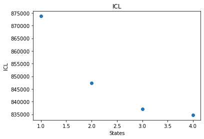
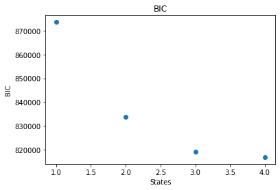
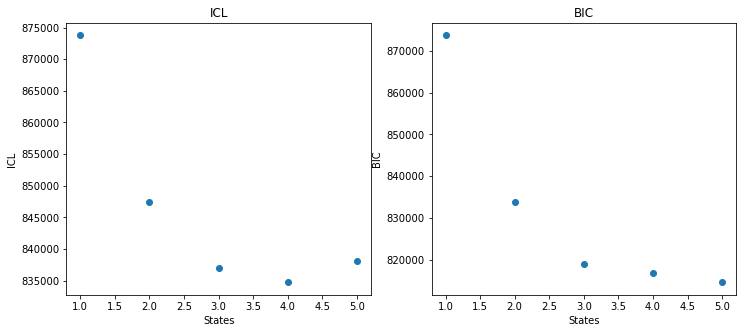
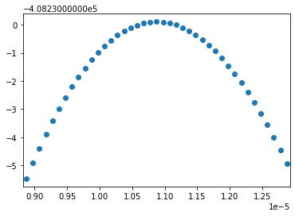

Basic Optimizations with H2MM_C
===============================

.. currentmodule:: H2MM_C

.. seealso::

    This can also be viewed as a Jupyter Notebook
    Downlaod :download:`H2MM_Optimization_Tutorial.ipynb  <notebooks/H2MM_Optimization_Tutorial.ipynb>`

    The data files can be downloaded here: :download:`sample_data_2det.txt <notebooks/sample_data_2det.txt>` :download:`sample_data_3det.txt <notebooks/sample_data_3det.txt>`

First let's import some standard modules:

.. code-block::

    import os
    import numpy as np
    from matplotlib import pyplot as plt

    import H2MM_C as hm

Basic Analysis
--------------

The base steps of analysis with |H2MM| are:

#. Load data
#. Make initial model
#. Optimize model
#. *Viterbi* analysis to classify photons and assess quality of optimization

.. note::

   Steps 2-4 are usually repeated multiple times with different numbers of states and result compared to select the ideal model

Step 1: Load Data
*****************

Now that the data is imported, we can start to perform the basic analysis of |H2MM|, for which we will need some data to analyze. So we will load some data with the following lines of code:

.. code-block::

    # This cell will only be used if you export your data to an ascii file,
    # if you are using a software package such as FRETBursts, a different
    # function (for FRETBursts, look at our other Jupyter Notebooks, it is
    # the data_sort function)
    def load_txtdata(filename):
        color = list()
        times = list()
        with open(filename,'r') as f:
            for i, line in enumerate(f):
                if i % 2 == 0:
                    times.append(np.array([int(x) for x in line.split()],dtype=np.int64))
                else:
                    color.append(np.array([int(x) for x in line.split()],dtype=np.uint8))
        return color, times
    
    color2, times2 = load_txtdata('sample_data_2det.txt')

Data Organization
~~~~~~~~~~~~~~~~~

So what does this data look like?
It comes in 2 lists of arrays.
One list contains the detectors (indices) of the data.
The second, the times of the data.

- :code:`color2` contains the detectors
- :code:`times2` contaisn the times of the data

Both are lists of 1-D numpy arrays.

.. note::

   The size of the detector list and time list, and of the arrays within must match.
   This is because each data point is a pair of numbers: the index of the detector, and the *absolute* time of the data point.
   Each array (element of the two lists) is a sequence of data that is to be anlayzed as a separate instance of data that can be represented by the same hidden Markov model.
   Therefore the length of :code:`color2` must be the same as the length of :code:`times2`
   Similarly, the length of the first array in :code:`color2` must be the same as the length of the first array in :code:`times2`.
   The lengths of the second arrays in :code:`color2` and :code:`times2` must also match, and so on.
   There is no need however for the lengths of the first and second arrays in :code:`color2` and :code:`times2` to match, as sequences of data points need not be the same length.

For the next step, it is important that the nubmer of detectors is known, as this affects the initial model to be used.
In the example loaded above, there are 2 detectors- 0 and 1.

.. note::

   Indices must start from 0 and go in integer ascending order.
   I.E. if there are 2 detectors, you must use indices 0 and 1.
   Similarly, if there are 3 indices you must use indices 0, 1 and 2.
   And so on.

>>> color2[0], times2[0]
(array([1, 0, 1, 1, 0, 0, 0, 0, 1, 0, 0, 1, 1, 0, 0, 0, 0, 0, 0, 1, 1, 1,
        1, 1, 1, 1, 0, 1, 1, 0, 0, 1, 0, 0, 1, 1, 1, 1, 1, 0, 0],
       dtype=uint64),
array([12763662, 12766593, 12769260, 12769677, 12775221, 12781399,
        12783890, 12795124, 12795391, 12796727, 12797800, 12798471,
        12798527, 12799163, 12799626, 12802748, 12808470, 12811473,
        12826887, 12841103, 12842716, 12842791, 12844203, 12844446,
        12845687, 12846645, 12847506, 12848115, 12850099, 12853216,
        12853259, 12853526, 12853632, 12853845, 12855027, 12858436,
        12858750, 12860935, 12861560, 12861894, 12869843], dtype=uint64))

Step 2: Create an Initial Model
*******************************

|H2MM| is fundamentally an optimization, which means that an initial, unoptimized model must be used as a starting point to initiate the optimization.

These models are represented by the :class:`h2mm_model` in **H2MM_C**.
**H2MM_C** provides a simple function for creating initial models: :func:`factory_h2mm_model`.
All you need to do is specify the number of states and the number of detectors.

.. note::

    The number of **states** is arbitrary, as we will show later.
    You should compare several different numbers of states.
    The number of **detectors**, however is determined by your data.
    For the file `sample_data_2det.txt` there are 2 detectors.

So let's make the initial model.
The synax is:

``hm.factory_h2mm_model(nstate: int, ndet: int)``

So let's make an initial model:

.. code-block::

    imodel_3s2d = hm.facotry_h2mm_model(3,2) # 3states, 2 detectors

Step 3: Optimize the Model
**************************

Now that we have an initial model, we can optimize it against the data.
For this we use the :func:`EM_H2MM_C` function.

.. note::

    The function name has historical roots, which for backwards compatibility we will maintain indefinitely.
    Apologies for the strange name.

The syntax is 

``hm.EM_H2MM_C(init_model: hm.h2mm_model, indexes: list[numpy.ndarray], times: list[numpy.ndarray])``

So let's optimize the model:

.. code-block::

    model_3s2d = hm.EM_H2MM_C(imodel_3s2d, color2, times2)
    model_3s2d

| The model converged after 2846 iterations

| nstate: 3, ndet: 2, nphot: 239701, niter: 2846, loglik: -120029.31040593554 converged state: 0x27
| prior:
| 0.2272268169697541, 0.3356458088268423, 0.43712737420340364
| trans:
| 0.9999737418742817, 2.625812450388196e-05, 1.2144162651673179e-12
| 1.4552276266225378e-05, 0.9999710725953526, 1.4375128381104806e-05
| 1.1159734391275203e-06, 1.0270624307327267e-05, 0.9999886134022535
| obs:
| 0.3071558790693713, 0.6928441209306287
| 0.7830415401641657, 0.21695845983583428
| 0.8905661980180328, 0.10943380198196716

Examining the optimized model
~~~~~~~~~~~~~~~~~~~~~~~~~~~~~

The core of a :class:`h2mm_model` is composed of 3 arrays.
In the following definition, N will indicate the number of states, and M the number of detectors.

- :attr:`h2mm_model.prior`: the initial probability vector, of shape N, which represents the probability of a sequence beginning in each state.
- :attr:`h2mm_model.trans`: the transition probability matrix, of shape N by N, the probability of a transition happening from state i to state j.

  .. note::

     The units of the transition probability matrix are in units fo the clock-rate of the data

- :attr:`h2mm_model.obs`: the emission probability matrix, of shame N by M. The probability that if the system is in state i, the detector j will be observed.

.. note::

   All the above arrays are **row stochastic** meaning that the sum of the values in each row sum to 1.
   This is because these are all probabilities and each row enumerates all possibilities, thus their total probability must be 1.
   Calculate values accordingly

These are all printed as part of the reper for :class:`h2mm_model`

There are a number of other secondary parameters stored in the :class:`h2mm_model` object.
The size of the matrices can be accessed with

- :attr:`h2mm_model.nstate` the number of states
- :attr:`h2mm_model.ndet` the number of detectors

Others are specific to the course of the optimization

- :attr:`h2mm_model.niter` The number of iterations during the optimization
- :attr:`h2mm_model.nphot` The number of data points in the input data on which the model was optimized

There are the statistical parameters that reflect the likelihood of the model:

- :attr:`h2mm_model.loglik` The loglikelihood of the model. This represents the value which is being optimized.
- :attr:`h2mm_model.bic` The Bayes Information Criterion, a statistical discriminator. :math:`BIC = k\ln(n) - 2\ln(LL)` where :math:`k = nstate^2 - (ndet - 1)nstate - 1`, this is used for comparing loglikelihoods of different models with different numbers of states, but optimized against the same data.
- :attr:`h2mm_modle.k` The number of free parameters in the model.

Step 4: *Viterbi* Analysis
**************************

The final step in the |H2MM| analysis of a single model is to find the most likely state-path through the data.
This is done using the *Viterbi* algorithm.

For this ``H2MM_C`` has the :func:`viterbi_path` function.
This function returns the most likely state path as well as a few other useful values.
These values are:

- ``path``: The most likely state of each data point
- ``scale``: the likelihood of each state assignment in ``path``, i.e. the posterior probability
- ``loglik``: The loglikelihood of each trajectory, returned as a numpy array.
- ``ICL``: The Integrated Complete Likelihood, a statistical discriminator, which is essentially the :math:`BIC`, but for the most likely path instead of all possible paths.

The syntax is:

``hm.viterbi_path(model: H2MM_C.h2mm_model, indexes: list[numpy.ndarray], times: list[numpy.ndarray])``

.. code-block::

    path_3s2d, ll_3s2d, icl_3s2d = hm.viterbi_path(model_3s3d, color2, times2)
    path_3s2d[0]

| array([0, 0, 0, 0, 1, 1, 1, 1, 1, 1, 1, 1, 1, 1, 1, 1, 1, 1, 1, 0, 0, 0,
|        0, 0, 0, 0, 0, 0, 0, 0, 0, 0, 0, 0, 0, 0, 0, 0, 0, 0, 0],
|       dtype=uint64)

Loop Based Analysis
-------------------

Since we need to compare different models, it is generally more useful to run the analysis in a loop, and then compare the different optimizations.

In particular, the *ICL* is very useful in identifying the best model.

We will also now use a data set with 3 detectors, so that we can see how different detector numbers affect the analysis code.

.. code-block::

    color3, times3 = load_txtdata('sample_data_3det.txt')

For this we will start with a simple loop, optimizing for 1 to 4 states (there's no such thing as a 0 state model)

.. code-block::

    # initiate lists
    models = list()
    paths = list()
    scales = list()
    logliks = list()
    ICL = list()

    # loop from 1 to 4 states
    for i in range(1,5):
        # make initial model with i states
        imodel_temp = hm.factory_h2mm_model(i, 3) # i states, 3 detectors
        # optimize model
        model_temp = hm.EM_H2MM_C(imodel_temp, color3, times3)
        # calculate ideal state path
        path_temp, scale_temp, ll_temp, icl = hm.viterbi_path(model_temp, color3, times3)
        # append results to lists
        models.append(model_temp)
        paths.append(path_temp)
        scales.append(scale_temp)
        logliks.append(ll_temp)
        ICL.append(icl)
    models

| The model converged after 2 iterations
|
| The model converged after 83 iterations
|
| The model converged after 191 iterations
|
| Optimization reached maximum number of iterations

| [nstate: 1, ndet: 3, nphot: 436084, niter: 2, loglik: -436870.2664181456 converged state: 0x27
|  prior:
|  1.0
|  trans:
|  1.0
|  obs:
|  0.40807734289723996, 0.14158969372873118, 0.45033296337402884,
|  nstate: 2, ndet: 3, nphot: 436084, niter: 83, loglik: -416808.46054400457 converged state: 0x27
|  prior:
|  0.28420054140898077, 0.7157994585910192
|  trans:
|  0.9999702727327167, 2.9727267283272445e-05
|  1.361494142422072e-05, 0.9999863850585758
|  obs:
|  0.15584402506221606, 0.2649819949425368, 0.579173979995247
|  0.5300103898756764, 0.08194016213702787, 0.38804944798729574,
|  nstate: 3, ndet: 3, nphot: 436084, niter: 191, loglik: -409379.1470199655 converged state: 0x27
|  prior:
|  0.25991614498503546, 0.4943766688551101, 0.2457071861598543
|  trans:
|  0.99997620100061, 2.1091530647357298e-05, 2.7074687426012416e-06
|  8.392831156401812e-06, 0.9999812080804615, 1.0399088382201267e-05
|  6.290351439278574e-06, 4.466205603341952e-05, 0.9999490475925273
|  obs:
|  0.14570425274135482, 0.2934431598919638, 0.5608525873666814
|  0.44173952215070467, 0.08763105601610255, 0.47062942183319284
|  0.8414287299383637, 0.07852868414074801, 0.08004258592088825,
|  nstate: 4, ndet: 3, nphot: 436084, niter: 3600, loglik: -408229.8870830556 converged state: 0x47
|  prior:
|  0.6260350194522536, 0.03065208094489406, 0.19098128141081058, 0.15233161819204177
|  trans:
|  0.755356522950715, 0.10496527792311883, 0.1396781991261662, 2.5473360035781177e-93
|  1.9483774568912126e-05, 0.9999676455004775, 1.0873612638551622e-05, 1.9971123150751066e-06
|  4.55729580226709e-06, 6.533151970496898e-06, 0.9999789904946441, 9.919057583121052e-06
|  2.89221723510831e-06, 2.6479397449634016e-06, 3.798997443069558e-05, 0.9999564698685893
|  obs:
|  0.6182798684674422, 0.3817201315325577, 2.4250145435136427e-68
|  0.14426145606515778, 0.2895270449307156, 0.5662114990041266
|  0.4416386060438939, 0.0870081949493097, 0.4713531990067965
|  0.8409805356960829, 0.07645731068492255, 0.08256215361899454]
 
Now that several models have been calculated, it is imortant to select the ideal model, so you do not use over- or under-fit models that do not properly represent the data.

There are two primary criterion for this:

#. A statistical discirminator like the *ICL* or *BIC*
#. Reasonableness of the model based on prior knowldege fo the system.

So let's plot the *ICL* to see what the best model is:

.. code-block::

    states = np.arange(1,5)
    plt.scatter(states, ICL)
    plt.xlabel("States")
    plt.ylabel("ICL")
    plt.title("ICL")

| Text(0.5, 1.0, 'ICL')

.. code::

    states = np.arange(1,5)
    plt.scatter(states, [model.bic for model in models])
    plt.xlabel("States")
    plt.ylabel("BIC")
    plt.title("BIC")

| Text(0.5, 1.0, 'BIC')

So it looks like the ideal model (minimum *ICL*) is the 4 state model.

But since this is also the most nubmer of states optimized, a 5 state model might be even better.
Even if the 4 state model is best, seeing that the *ICL* of the 5 state model increases, it is still best to optimize it so that we can be assured that the 4 state model is best.
And if the 5 state model turns out to have an even smaller *ICL*, we should go on and optimize a 6 state model.

.. code-block::

    imodel_temp = hm.factory_h2mm_model(5,3)
    model_temp = hm.EM_H2MM_C(imodel_temp, color3, times3)
    path_temp, scale_temp, ll_temp, icl = hm.viterbi_path(model_temp, color3, times3)
    models.append(model_temp)
    paths.append(path_temp)
    scales.append(scale_temp)
    logliks.append(ll_temp)
    ICL.append(icl)

| Optimization reached maximum number of iterations

.. code-block::

    states = [model.nstate for model in models]
    bic = [model.bic for model in models]

    fig, ax = plt.subplots(1,2, figsize=(12,5))

    ax[0].scatter(states, ICL)
    ax[0].set_xlabel("States")
    ax[0].set_ylabel("ICL")
    ax[0].set_title("ICL")

    ax[1].scatter(states, bic)
    ax[1].set_xlabel("States")
    ax[1].set_ylabel("BIC")
    ax[1].set_title("BIC")

| Text(0.5, 1.0, 'BIC')

Indeed, it looks like the 4 state model is the ideal model, so let's examine it:

.. code-block::

    models[3]

| nstate: 4, ndet: 3, nphot: 436084, niter: 3600, loglik: -408229.8870830556 converged state: 47
| prior:
| 0.6260350194522536, 0.03065208094489406, 0.19098128141081058, 0.15233161819204177
| trans:
| 0.755356522950715, 0.10496527792311883, 0.1396781991261662, 2.5473360035781177e-93
| 1.9483774568912126e-05, 0.9999676455004775, 1.0873612638551622e-05, 1.9971123150751066e-06
| 4.55729580226709e-06, 6.533151970496898e-06, 0.9999789904946441, 9.919057583121052e-06
| 2.89221723510831e-06, 2.6479397449634016e-06, 3.798997443069558e-05, 0.9999564698685893
| obs:
| 0.6182798684674422, 0.3817201315325577, 2.4250145435136427e-68
| 0.14426145606515778, 0.2895270449307156, 0.5662114990041266
| 0.4416386060438939, 0.0870081949493097, 0.4713531990067965
| 0.8409805356960829, 0.07645731068492255, 0.08256215361899454

User Defined Initial Models
---------------------------

Usually the :func:`factory_h2mm_model` function is sufficient for generating initial models, however, sometimes it is preferable to define the parameters of the initial model more manually.

This is done like so:

.. code::

    # define input prior, trans and obs matrices
    prior = np.array([0.5,0.5])
    trans = np.array([[0.99999, 0.00001], [0.00001, 0.99999]])
    obs = np.array([[0.2, 0.3, 0.5], [0.4, 0.2, 0.4]])

    # make the initial model
    imodel_user = hm.h2mm_model(prior, trans, obs)

We can optimize this just as before:

.. code-block::

    model_user = hm.EM_H2MM_C(imodel_user, color3, times3)
    model_user

| nstate: 2, ndet: 3, nphot: 436084, niter: 86, loglik: -416808.4605439878 converged state: 0x27
| prior:
| 0.2842005858570078, 0.7157994141429922
| trans:
| 0.9999702726711638, 2.9727328836273114e-05
| 1.3614977930264637e-05, 0.9999863850220698
| obs:
| 0.15584402059957542, 0.2649819669048419, 0.5791740124955829
| 0.5300104525521383, 0.08194014608492564, 0.38804940136293614

.. _h2mm_arr: 

:func:`H2MM_arr` and Error Analysis
-----------------------------------

You will notice that so far |H2MM| analysis has not given any estimation of the error of the parameter values.

One way to estimate the error is to compare how quickly the loglikelihood falls off as a given parameter is varied around the optimized value.

For this we not to just evaluate the loglikelihood of a model, instead of optimizing the model (we already have the optimized model).

To merely evaluate a set of models, we have the :func:`H2MM_arr` function.
The function call is nearly identical to :func:`EM_H2MM_C`:

``hm.H2MM_arr(models: list[hm.h2mm_model], indexes: list[numpy.ndarray], times: list[numpy.ndarray])``

The last two arguments are identical to :func:`EM_H2MM_C`, while the first is a little more flexible.
It can be a single :class:`h2mm_model` object, but more commonly it is a list of them.
It can even be a tuple or numpy object array.

:func:`H2MM_arr` will return the same data type it was given, but with the loglikelihoods of all the models evaluated.

For error evaluation, we will make a list of models, and vary just one value in them.
Since the 4 state model looks like the best model, lets try this on that model, and change the most interesting transition rate, that from state 1 to state 2 (states indexing from 0 since this is python after all).

.. code-block::

    # pull out the parameters of the model
    prior_4s3d = models[3].prior
    trans_4s3d = models[3].trans
    obs_4s3d = models[3].obs

    error_models = list()
    for tk in np.linspace(-2e-6, 2e-6, 41):
        new_trans = trans_4s3d.copy() # copy so that tweaks can be make without changing the original array
        new_trans[1,2] += tk
        new_trans[1,1] -= tk # adjust the diagonal so that matrix remains row stochastic
        tk_model = hm.h2mm_model(prior_4s3d, new_trans, obs_4s3d)
        error_models.append(tk_model)

Now we can use :func:`H2MM_arr`.

.. code-block::

    error_models = hm.H2MM_arr(error_models, color3, times3)

Now we can plot the loglikelihood and see how sharply it is centered on the optimal model:

.. code-block::

    trs  = [model.trans[1,2] for model in error_models]
    ll = [model.loglik for model in error_models]

    plt.scatter(trs, ll)
    plt.xlim([min(trs)-5e-8, max(trs)+5e-8])

| (8.823612638551623e-06, 1.292361263855162e-05)

.. |H2MM| replace:: H\ :sup:`2`\ MM
